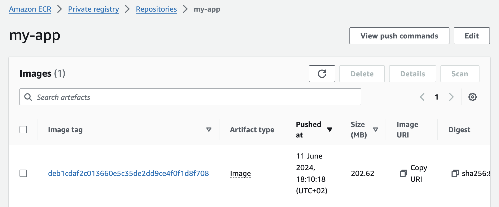

# Continuous Integration and Continuous Delivery using Amazon Web Services

This repository demonstrates a CI/CD pipeline for a simple Python application that is containerized and delivered to an AWS Elastic Container Registry.

The necessary infrastructure is provisioned via Infrastructure as Code using AWS CloudFormation. Once the infrastructure is provisioned, GitHub Actions are used to run unit tests, API tests, and to lint your code during continuous integration. When you feel confident to merge into the main branch, the application is dockerized and pushed to AWS Elastic Container Registry.

In the following steps, we will mention the AWS services that are used, how to configure the code to provision the infrastructure, how to provision it, and finally how to use it.

The intention of this project is to standardize the setup of a new project. Feel free to fork it and modify it to your needs.

## Table of Contents

- [Features](#features)
- [Getting Started](#getting-started)
- [Usage](#usage)
- [Contributing](#contributing)
- [Contact](#contact)

## Features

- **AWS CodeBuild**: Host GitHub runners on AWS CodeBuild for efficient build and test processes.
- **GitHub Actions**: Automate workflows directly from your GitHub repository for seamless integration.
- **Docker Integration**: Build and push Docker images to AWS Elastic Container Registry (ECR) upon merging to the main branch.
- **AWS CloudFormation**: Automate the setup of the necessary AWS infrastructure using CloudFormation templates.
- **Python Web App**: A simple FastAPI application that includes unit and API tests.

## Getting Started

Now, let's set up the project. We will talk about the prerequisites first, before we configure the infrastructure and finally provision it.

### Prerequisites

As we are using services from AWS, we need an AWS account and an IAM user with the necessary permissions to:

- Create CloudFormation stacks
- Use AWS CodeBuild
- Create an IAM Role that is used by an OIDC provider
- Access S3 to store build artifacts
- Permissions to push Docker images to AWS ECR

For detailed information, check out the AWS CloudFormation templates within the [iac](iac) folder.

As this project creates a CI/CD pipeline using a GitHub repository, it's required that you create your own. Either fork this repository or create a new one where you upload the files from this repository.

Last but not least, the AWS CLI needs to be configured as we use it to deploy the CloudFormation templates and create a repository in AWS ECR. Have a look at the AWS documentation on [how to set up the CLI](https://docs.aws.amazon.com/cli/latest/userguide/getting-started-quickstart.html).

Python version: 3.11
Poetry version: 1.8

### Configuration

Speaking about the AWS CloudFormation templates, this is also the place where we want to adjust the configuration in order to provision the infrastructure.
The templates currently contain a few details that make it work within this GitHub account. The following parameters are mandatory to change:

1. AWS CodeBuild uses a webhook to your repository. Therefore, provide the correct URL to your GitHub repository by updating the default value for the [GitHubRepo](iac/codebuild_project.yml#L13) parameter.
2. GitHub will be defined as an OIDC provider that will consume an IAM Role that allows it to push images to AWS ECR. Update the [ConditionKey](iac/github_oidc.yml#L5) parameter to limit which GitHub actions are able to assume the role. For more information, have a look at the [GitHub documentation](https://docs.github.com/en/actions/deployment/security-hardening-your-deployments/configuring-openid-connect-in-amazon-web-services).
3. Depending on which AWS region you deploy the CloudFormation stacks, you have to update the values in the [Makefile](Makefile#L4) as well as in the [GitHub Action](.github/workflows/build_and_push.yml#L9).
4. Your AWS account number as it is used by the [Makefile](Makefile#L5) to deploy the CloudFormation stacks and the [GitHub Action](.github/workflows/build_and_push.yml#L24) to consume the AWS role.

Optionally, you can update the following parameters:

1. [CodeBuild name](iac/codebuild_project.yml#L9) of your project.
2. [S3 bucket name](iac/codebuild_project.yml#L5) that CodeBuild uses to store build artifacts.
3. [IAM Role name](iac/github_oidc.yml#L9) that is used by the OIDC provider.
4. [Policy name](iac/github_oidc.yml#L13) that is associated with the IAM role to provide permissions to push Docker images to AWS ECR. If you change the name, update it also within the [GitHub Action](.github/workflows/build_and_push.yml#L24).
5. [Repository name](iac/ecr_repository.yml#L6) in AWS ECR where the Docker images are pushed to. If you change the value, make sure you also update it in the [Makefile](Makefile#L2) as well as in the [GitHub Action](.github/workflows/build_and_push.yml#L32).

### Provision Infrastructure

As we created a new repository and configured the parameters of the CloudFormation template accordingly, we can now go ahead and provision the infrastructure. When you follow the steps in the configuration section, you can make use of the commands defined within the [Makefile](Makefile).

1. Provision the AWS CodeBuild project

    This will create a CodeBuild project, an S3 bucket to store the build artifacts, and the necessary service role with the permissions to write to S3 as well as to send logs to AWS CloudWatch.

    ```bash
    make provision_codebuild
    ```

    

2. Provision GitHub as an OIDC

    The following command will define GitHub as an OIDC provider and create an IAM role with a web identity that the GitHub Actions can use to push Docker images to AWS ECR.

   ```bash
    make provision_oidc
    ```

    

3. Provision ECR Repository
  
    Finally, create an AWS ECR repository where the Docker images are pushed to.

   ```bash
    make provision_ecr
    ```

## Usage

### Local Development

To run the application locally, you can use Poetry to install the necessary packages in a virtual environment.

```bash
poetry install
```

After this, you have the options to:

1. Run the application

    ```bash
    make run
    ```

2. Execute the unit tests

    ```bash
    make test_unit
    ```

3. Execute the API tests

    ```bash
    make test_api
    ```

### Push to Feature Branch

When you push your code to any branch except the main branch, GitHub Actions will run the [unit tests](.github/workflows/test_unit.yml).

### Pull Request

When you create a pull request to any branch, GitHub Actions will run the [API tests](.github/workflows/test_api.yml) as well as perform code checks to ensure code quality by using a [linter](.github/workflows/super_linter.yml).


### Merge to Main Branch

If all the checks pass and you merge the pull request into the main branch, the GitHub Actions will [build and push](.github/workflows/build_and_push.yml) a Docker image with the image tag of the commit to AWS ECR.



## Contributing

If you have ideas for improvements or have already implemented them, please open a [GitHub Issue](../../issues) or a [Pull Request](../../pulls).

## License

This project is licensed under the MIT License - see the [LICENSE](LICENSE) file for details.

## Contact

The easiest way to contact me is via my [LinkedIn](https://www.linkedin.com/in/christian-dienbauer/) profile.
